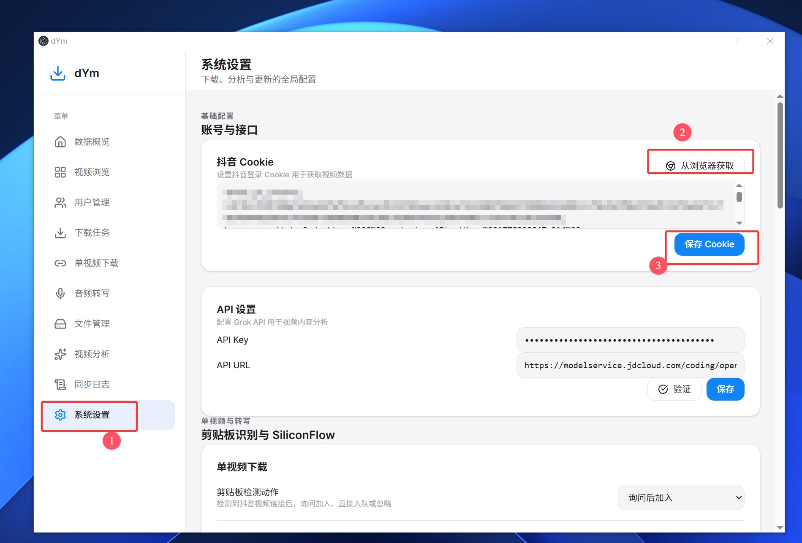
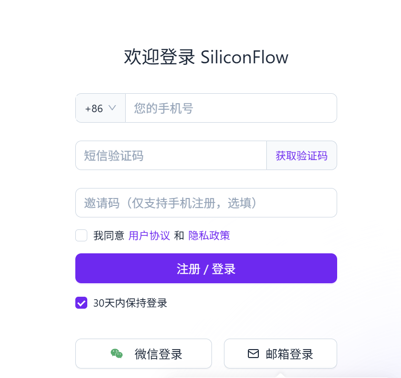
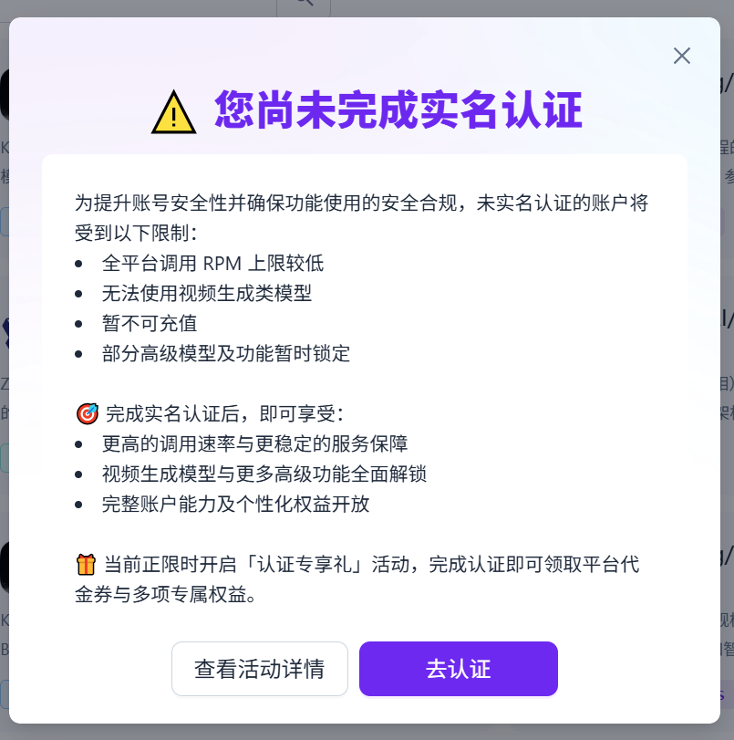
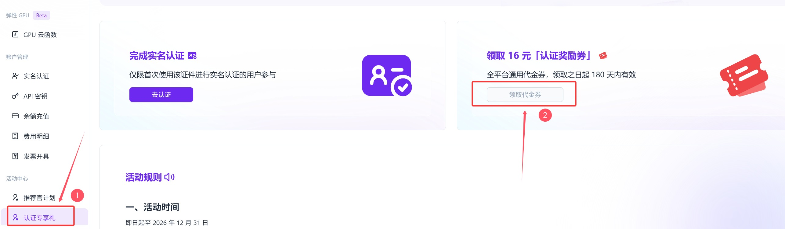
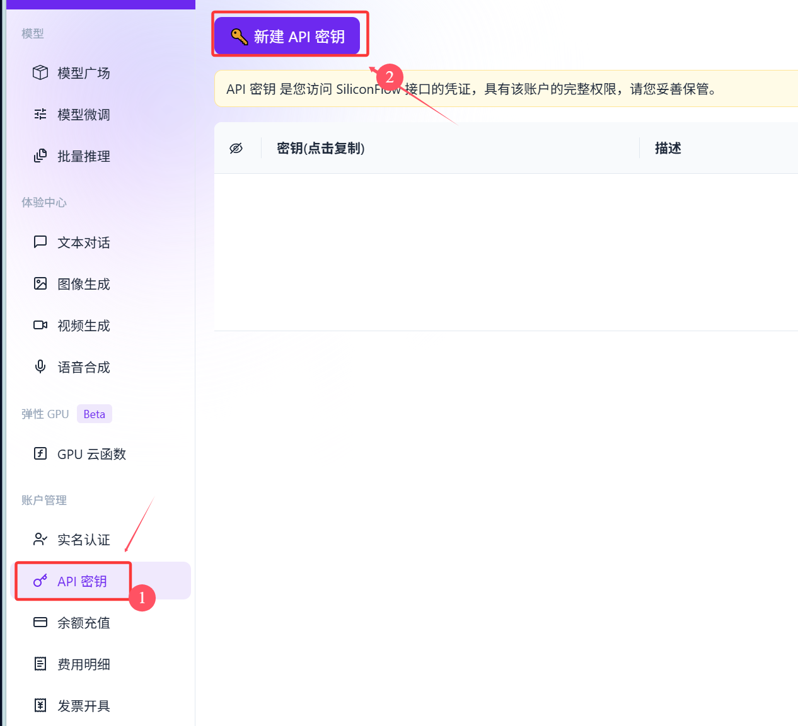
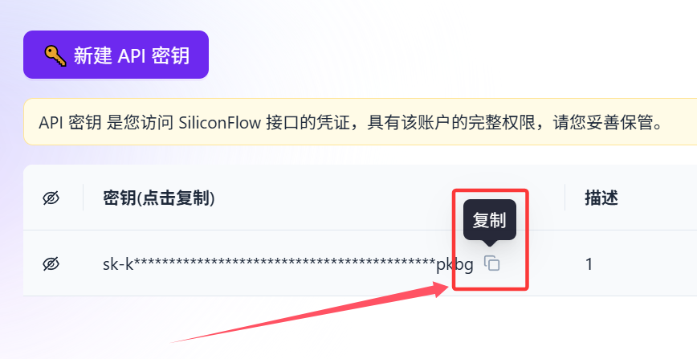
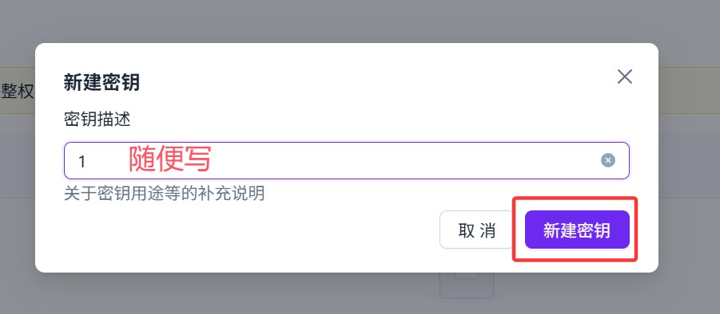
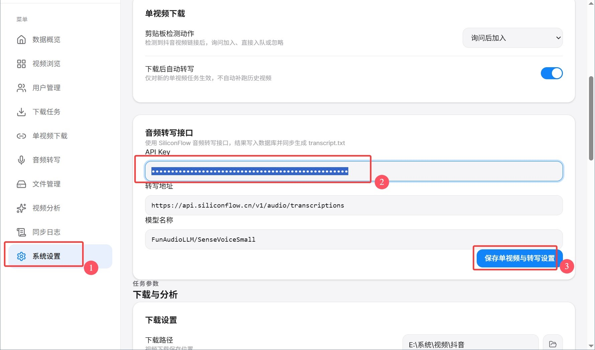

# dYm

**[English](README.md) | [中文](README_CN.md)**

> 面向抖音内容采集、下载、分析与音频转写的一体化桌面工具（Electron + TypeScript）

[](https://www.electronjs.org/)
[](https://reactjs.org/)
[](https://www.typescriptlang.org/)
[](LICENSE)

dYm 是一款集 **抖音无水印下载**、**AI 内容分析** 与 **音频转写** 于一体的桌面应用，适合内容创作者、运营人员和研究场景下的素材采集、整理、检索与归档。

[当前仓库](https://github.com/jianji112/dYm-single-video-transcribe)

---

## 项目来源

本项目由 [Everless321/dYm](https://github.com/Everless321/dYm) 修改而来。

感谢原作者开源分享，为本项目提供了稳定的下载、整理与分析基础。本项目在保留原项目许可证的前提下，继续扩展单视频下载、音频转写等能力。

当前维护分支：

- [jianji112/dYm-single-video-transcribe](https://github.com/jianji112/dYm-single-video-transcribe)

---

## 本项目新增功能

- **单视频下载模块**
  支持短链接、完整作品链接、`jingxuan` 链接，以及包含链接的整段分享文案直接入队下载。
- **剪贴板智能分流**
  自动识别剪贴板中的抖音作品链接，并进入单视频下载流程；用户主页链接仍保留原有添加用户逻辑。
- **单视频作者可配置是否加入用户管理**
  默认不加入用户管理，避免单视频来源作者干扰批量下载列表；也可以在设置中改为默认加入。
- **视频音频转写**
  下载完成后可自动提取视频音频，并接入 SiliconFlow 语音转文字接口完成转写。
- **转写结果落库与导出**
  转写结果会写入本地数据库，同时在作品目录生成 `transcript.txt`，支持软件内查看、复制和导出。

---

## 核心功能

- **用户管理**
  添加和管理抖音用户，支持刷新资料、批量维护与下载策略配置。
- **批量下载**
  支持并发无水印下载、任务跟踪、定时同步与失败重试。
- **AI 内容分析**
  对下载后的作品进行结构化分析，生成标签、分类、摘要、场景和内容等级。
- **本地数据管理**
  所有数据默认保存在本地 SQLite 数据库中，便于检索、迁移与备份。
- **文件管理**
  支持查看已下载作品、打开目录、检查损坏文件并重新标记下载。
- **系统托盘运行**
  可最小化到托盘，在后台持续运行。

---

## 快速开始

1. 从 [Releases](https://github.com/jianji112/dYm-single-video-transcribe/releases) 下载最新安装包
2. 打开 dYm，在设置中配置抖音 Cookie
3. 按需添加用户，或直接粘贴单视频链接 / 分享文案
4. 下载完成后，可继续进行 AI 分析或音频转写

---

## 配置教程

<a id="douyin-config-tutorial"></a>
### 抖音配置教程

步骤已经按素材顺序整理如下：

1. 点击“从浏览器获取”。
2. 在弹出的浏览器中登录抖音。
3. 登录完成后退出浏览器。
4. 返回软件后点击“保存 Cookie”。



<a id="transcription-config-tutorial"></a>
### 音频转写配置教程

请按素材文件名对应的顺序完成：

1. 点开 [SiliconFlow 转写注册链接](https://cloud.siliconflow.cn/i/QhTuVb78) 后注册用户



2. 实名认证



3. 领取代金券



4. 创建 API



5. 复制密匙



6. 新建密匙



7. 添加密匙到软件中保存



---

## 安装与开发

### 从源码运行

```bash
git clone https://github.com/jianji112/dYm-single-video-transcribe.git
cd dYm-single-video-transcribe
npm install
npm run dev
```

### 下载预编译版本

前往 [Releases](https://github.com/jianji112/dYm-single-video-transcribe/releases) 获取安装包。

---

## 构建

```bash
# macOS
npm run build:mac

# Windows
npm run build:win

# Linux
npm run build:linux

# 仅编译，不打包
npm run build:unpack
```

构建产物默认输出到 `dist/` 目录。

---

## 技术栈

- **框架**：Electron + React 19 + TypeScript
- **UI**：Tailwind CSS + Radix UI + shadcn/ui
- **数据库**：better-sqlite3
- **下载引擎**：[dy-downloader](https://github.com/Everless321/dyDownload)
- **视频处理**：fluent-ffmpeg
- **AI 接口**：OpenAI 兼容视觉接口 + SiliconFlow 音频转写接口

---

## 许可说明

本项目遵循 [GPL v3](https://www.gnu.org/licenses/gpl-3.0.html) 许可证。

---

## 免责声明

本工具仅供学习、研究与个人效率场景使用。请遵守当地法律法规及相关平台服务条款；下载内容的版权归原作者所有。
